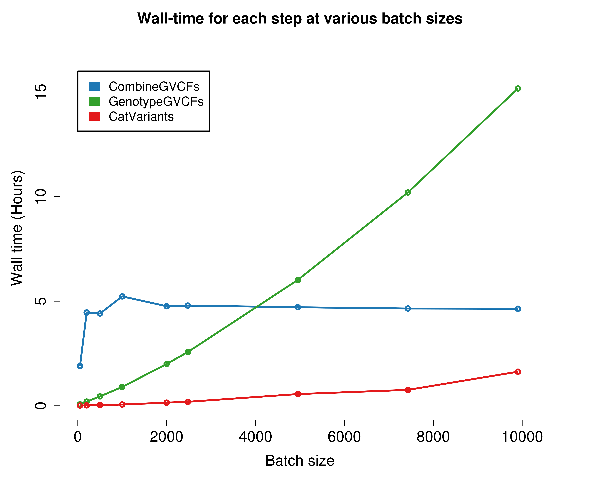

# JointGenotyping_BW

## Introduction
This workflow for the Blue Waters supercomputer conducts joint genotyping on very large cohorts of single-sample GVCFs. After several input preparation steps, it runs GATK GenotypeGVCFs command on randomly selected subsamplings of various sizes from the larger cohort of single-sample GVCFs generated by GATK HaplotypeCaller.

## Step 1: Randomly select user-specified number of GVCFs from cohort
GVCFs must first be combined into groups because the joint genotyping step can handle no more than a few hundred individual files. **Generate_Subsamples_BW.sh** creates a master list of all GVCFs contained within the paths specified by the user. The script then splits the master list into smaller files each listing 100 randomly selected GVCFs. The total number of GVCFs to select randomly from the master list (in sets of 100) is determined by an input parameter to the script.

The syntax is  
bash Generate_Subsamples_BW.sh \<number of GVCFs to select randomly from all GVCFs> \<subsample number followed by underscore and aligner used> \<path to root directory for output>  \<paths to GVCFs>

For example:

```
bash Generate_Subsamples_BW.sh 1000 Subsample1_BWA ./Randomized_Subsamplings ./GVCF_group1_directory ./GVCF_group2_directory ./GVCF_group3_directory
```

## Step 2: Combine GVCF files (CombineGVCFs_BW.sh)
**CombineGVCFs_BW.sh** uses GATK's CombineGVCFs command to combine the randomly selected GVCFs from the previous step into files containing 100 GVCFs each. CombineGVCFs drastically reduces the number of individual files input to joint genotyping. On Blue Waters, 4 CombineGVCFs commands with a Java heap size of 15g are assigned to each node. Walltime is approximately 5 hours for all batch sizes (see scalability analysis).

The syntax to run **Combine_GVCFs_BW.sh** is  
*bash CombineGVCFs_BW.sh \<reference assembly to use: hg19 or hg38> \<directory containing samples_list directory generated by the previous command>*

For example:

```
bash CombineGVCFs_BW.sh hg19 ./Randomized_Subsamplings/Subsample1_BWA 
```

## Step 3: Jointly genotype samples (GenotypeGVCFs_CatVariants_BW.sh)
**GenotypeGVCFs_CatVariants_BW.sh** runs the GenotypeGVCFs command on 99 sets of 2000 exonic intervals each to facilitate parallel processing. The output is 1 VCF for each 2000-interval set. On Blue Waters, 6 GenotypeGVCFs commands (each covering one interval set) with a Java heap size of 10g are assigned to each node, for a total of 17 nodes. Walltime increases linearly with batch size; 500 samples takes 30 minutes, whereas 5000 samples takes 6 hours (see scalability analysis below).

Following the completion of all GenotypeGVCFs commands, GATK's CatVariants command is used to combine VCFs from each interval into a single VCF containing variants from all intervals.

The syntax to run **GenotypeGVCFs_CatVariants_BW.sh** is  
*bash CombineGVCFs_BW.sh \<reference assembly to use: hg19 or hg38> \<title to use for output directory; typically any special GenotypeGVCFs parameters used> \<path to combined GVCFs> \<path to Delivery directory for final VCF output>*

For example:

```
bash GenotypeGVCFs_CatVariants_BW.sh hg19 defaults ./Randomized_Subsamplings/Subsample1_BWA/combined_GVCFs ./Delivery 
```


## Scalability analysis 

