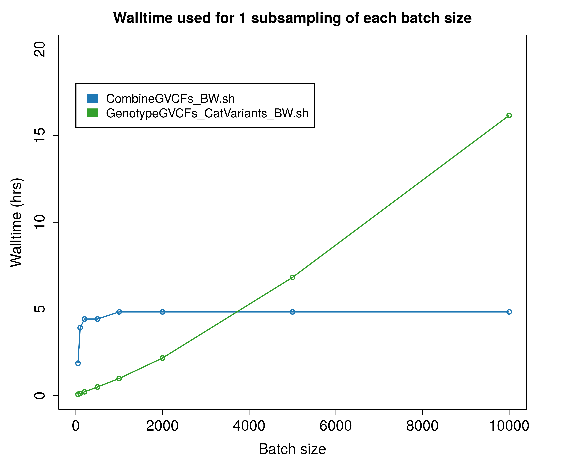
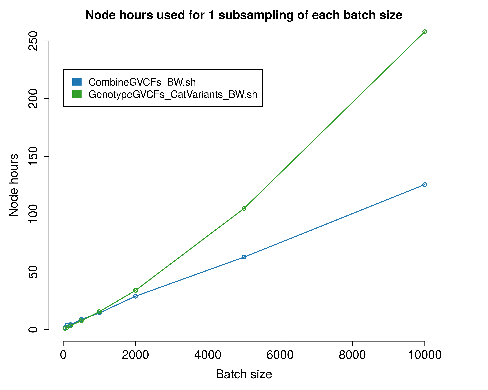

# JointGenotyping_GATK_BW

## Introduction
This workflow for the Blue Waters supercomputer conducts joint genotyping on very large cohorts of single-sample GVCFs. After several input preparation steps, it runs GATK GenotypeGVCFs on randomly selected subsamplings of various sizes from the larger cohort of single-sample GVCFs generated by GATK HaplotypeCaller.

## Step 1: Randomly select user-specified number of GVCFs from cohort
GVCFs must first be combined into groups because the joint genotyping step can handle no more than a few hundred individual files. **Generate_Subsamples_BW.sh** creates a master list of all GVCFs contained within the paths specified by the user. The script then splits the master list into smaller files each listing 100 randomly selected GVCFs. The total number of GVCFs to select randomly from the master list (in sets of 100) is determined by an input parameter to the script.

The syntax is  
bash Generate_Subsamples_BW.sh \<number of GVCFs to select randomly from all GVCFs> \<subsample number followed by underscore and aligner used> \<path to root directory for output>  \<paths to GVCFs>

For example:

```
bash Generate_Subsamples_BW.sh 1000 Subsample1_BWA ./Randomized_Subsamplings ./GVCF_group1_directory ./GVCF_group2_directory ./GVCF_group3_directory
```

## Step 2: Combine GVCF files (CombineGVCFs_BW.sh)
**CombineGVCFs_BW.sh** uses GATK's CombineGVCFs command to combine the randomly selected GVCFs from the previous step into files containing 100 GVCFs each. CombineGVCFs drastically reduces the number of individual files input to joint genotyping. On Blue Waters, 4 CombineGVCFs commands with a Java heap size of 15g are assigned to each node. Walltime is approximately 5 hours for all batch sizes (see scalability analysis).

The syntax to run **Combine_GVCFs_BW.sh** is  
*bash CombineGVCFs_BW.sh \<reference assembly to use: hg19 or hg38> \<subsample directory containing samples_list directory generated by Generate_Subsamples_BW.sh; this will also be the output directory for this script>*

For example:

```
bash CombineGVCFs_BW.sh hg19 ./Randomized_Subsamplings/Subsample1_BWA 
```

## Step 3: Jointly genotype samples (GenotypeGVCFs_CatVariants_BW.sh)
GATK's GenotypeGVCFs command improves the sensitivity and accuracy of genotype calls by using population-wide information from the cohort of single-sample gVCFs generated by HaplotypeCaller. **GenotypeGVCFs_CatVariants_BW.sh** runs GenotypeGVCFs on 99 sets of 2000 exonic intervals each to facilitate parallel processing. 

The output of this script is 1 VCF for each 2000-interval set. On Blue Waters, 6 GenotypeGVCFs commands (each covering one interval set) with a Java heap size of 10g are assigned to each node, for a total of 17 nodes. Walltime and node hours requirements increase linearly with batch size; 500 samples takes 45 minutes and uses 79 node hours , whereas 5000 samples takes 6 hours and uses 1050 node hours (see scalability analysis below).

Following the completion of all GenotypeGVCFs commands, GATK's CatVariants command is used to combine VCFs from each interval into a single VCF containing variants from all intervals.

The syntax to run **GenotypeGVCFs_CatVariants_BW.sh** is  
*bash CombineGVCFs_BW.sh \<reference assembly to use: hg19 or hg38> \<title to use for output directory; typically any special GenotypeGVCFs parameters used> \<path to combined GVCFs>*  

For example:

```
bash GenotypeGVCFs_CatVariants_BW.sh hg19 defaults ./Randomized_Subsamplings/Subsample1_BWA/combined_GVCFs
```

## Step 4: Variant quality score recalibration (VQSR_BW.sh)
**VQSR_BW.sh** runs GATK's VQSR command to compute new, well-calibrated quality scores for all variants. Known as VQSLOD, the score represents the log odds ratio that a variant is true under the trained Gaussian mixture model.   

VQSR consists of two commands, VariantRecalibrator and ApplyRecalibration. VariantRecalibrator develops the Gaussian mixture model based on the annotations of a high-quality subset of the analyzed data; the high-quality subset is comprised of analyzed variants that overlap with a highly validated call set (1000 Genomes HapMap and Omni genotyping array sites). Within this subset of the analyzed data, VariantRecalibrator examines the annotation profiles at each site to determine "rules" for recognizing good and bad variants. Once developed, the rules are applied to all sites, even those not overlapping with the highly validated call sets. 

ApplyRecalibration applies the model to each variant in the data. This command creates "tranches," or partitions based on the confidence of each site's variant call. The specificity threshold given to this command determines the level of filtering. All variants in the input VCF appear in the output VCF, but only those that meet the confidence cutoff contain the "PASS" designation in the INFO column; for sites falling below this cutoff (i.e. false positives), the VCF lists the tranche to which they belong.

The syntax to run **VQSR_BW.sh** is  
*bash VQSR_BW.sh \<reference assembly to use: hg19 or hg38> <desired target sensitivity for SNPs> <desired target sensitivity for INDELs> <GenotypeGVCFs final VCF directory for batch (must quote if wildcards used>* 

For example:


```
bash VQSR_BW.sh hg19 99.5 99 "/scratch/sciteam/jacobrh/purge_exempt/ADSP_VarCallResults/ADSP_JointGenotyping/hg19/BWA-GATK_HC_defaults/Randomized_Subsamplings/BatchSize50/Subsample*_BWA/final_VCF/GenotypeGVCFs-defaults"  
```

## Scalability analysis 

### Walltime


### Node hours

